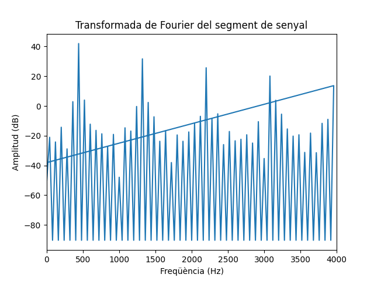

Primera tasca APA 2023: Anàlisi fitxer de so
============================================

## Nom i cognoms: Johny Silva Mendes

Proves i exercicis a fer i entregar
-----------------------------------
# 1.  frequencia: fx = 4kHz, fx = 9kHz, fx = 2kHz 

fent servir diferents freqüències per la sinusoide podem observar en una mateixa gràfica els diferents períodes de les diferents senyals i en una altre gràfica els diferents mòduls i fases en funció dels valors. 

# 2.
Resultat gràfic de 5 períodes de senyal: 

Representació del mòdul i la fase, en funció de la posició de cada valor: 

# 3. Representar el mòdul de la Transformada de Fourier en dB i l'eix d'abscisses en 0 a fm/2 en Hz

modul = abs(X) 
moduldb = 20 * np.log10(modul/max(modul))

# 4. Llegir un fitxer d'audio

x_r, fm = sf.read('so_prueba.wav')

 Evolució temporal d'un segment de 25ms del senyal: 

 

 Transformada en dB en funció de la freqüència:

Frequències més importants del segment: 

Per saber les freqüències més importants, hem de saber els punts màxims de la Transformada de Fourier (FFT) en dB, es a dir, les freqüències que tenen més amplitud.

Això es pot fer amb la funció argmax de Numpy per trobar la posició del valor màxim i llavors consultar el valor corresponent en l'eix de freqüència.