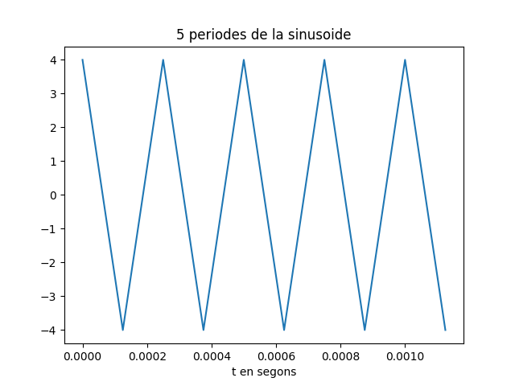

Primera tasca APA 2023: Anàlisi fitxer de so
============================================

## Nom i cognoms: Johny Mendes

Proves i exercicis a fer i entregar
-----------------------------------
# 1.  frequencia: fx = 4kHz, fx = 9kHz, fx = 2kHz 

fent servir diferents freqüències per la sinusoide podem observar en una mateixa gràfica els diferents períodes de les diferents senyals i en una altre gràfica els diferents mòduls i fases en funció dels valors. 

# 2.
Resultat gràfic de 5 períodes de senyal: 

Representació del mòdul i la fase, en funció de la posició de cada valor: 

